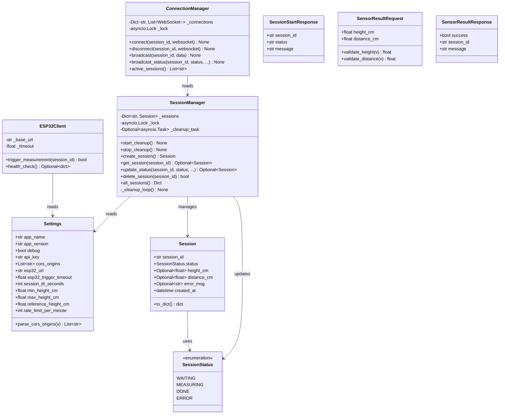

# Class Diagram

## Backend

```mermaid
classDiagram
    class Settings {
        +str app_name
        +str app_version
        +bool debug
        +str api_key
        +List~str~ cors_origins
        +str esp32_url
        +float esp32_trigger_timeout
        +int session_ttl_seconds
        +float min_height_cm
        +float max_height_cm
        +float reference_height_cm
        +int rate_limit_per_minute
        +parse_cors_origins(v) List~str~
    }

    class SessionStatus {
        <<enumeration>>
        WAITING
        MEASURING
        DONE
        ERROR
    }

    class Session {
        +str session_id
        +SessionStatus status
        +Optional~float~ height_cm
        +Optional~float~ distance_cm
        +Optional~str~ error_msg
        +datetime created_at
        +to_dict() dict
    }

    class SessionManager {
        -Dict~str, Session~ _sessions
        -asyncio.Lock _lock
        -Optional~asyncio.Task~ _cleanup_task
        +start_cleanup() None
        +stop_cleanup() None
        +create_session() Session
        +get_session(session_id) Optional~Session~
        +update_status(session_id, status, ...) Optional~Session~
        +delete_session(session_id) bool
        +all_sessions() Dict
        -_cleanup_loop() None
    }

    class ConnectionManager {
        -Dict~str, List~WebSocket~~ _connections
        -asyncio.Lock _lock
        +connect(session_id, websocket) None
        +disconnect(session_id, websocket) None
        +broadcast(session_id, data) None
        +broadcast_status(session_id, status, ...) None
        +active_sessions() List~str~
    }

    class ESP32Client {
        -str _base_url
        -float _timeout
        +trigger_measurement(session_id) bool
        +health_check() Optional~dict~
    }

    class SessionStartResponse {
        +str session_id
        +str status
        +str message
    }

    class SensorResultRequest {
        +float height_cm
        +float distance_cm
        +validate_height(v) float
        +validate_distance(v) float
    }

    class SensorResultResponse {
        +bool success
        +str session_id
        +str message
    }

    Session --> SessionStatus : uses
    SessionManager --> Session : manages
    SessionManager --> SessionStatus : updates
    ConnectionManager --> SessionManager : reads
    ESP32Client --> Settings : reads
    SessionManager --> Settings : reads
```

## Frontend

```mermaid
classDiagram
    class SessionContextValue {
        +Session|null session
        +bool isLoading
        +string|null error
        +startSession() Promise~string|null~
        +updateStatus(status, height_cm?, error_msg?) void
        +resetSession() void
    }

    class WebSocketContextValue {
        +bool isConnected
        +WebSocketMessage|null lastMessage
        +connect(sessionId) void
        +disconnect() void
        +string|null connectionError
    }

    class Session {
        +string session_id
        +SessionStatus status
        +number|null height_cm
        +number|null distance_cm
        +string|null error_msg
    }

    class WebSocketMessage {
        +string type
        +string session_id
        +SessionStatus status
        +number|null height_cm
        +string|null error_msg
    }

    class LandingPage {
        -bool showTutorial
        +handleDetect() void
        +handleUnderstand() void
    }

    class MeasurementPage {
        -Ref hasStarted
        +handleStart() Promise~void~
        +handleRetry() void
        +handleBack() void
    }

    class ResultPage {
        -bool showContent
        +handleScanAgain() void
    }

    class TutorialModal {
        +onClose() void
        +onUnderstand() void
    }

    class ScanAnimation {
        +bool isActive
    }

    class HeightDisplay {
        +number height
        -number displayValue
    }

    class StatusBadge {
        +SessionStatus status
    }

    class ErrorCard {
        +string message
        +onRetry?() void
    }

    LandingPage --> TutorialModal : renders
    MeasurementPage --> ScanAnimation : renders
    MeasurementPage --> StatusBadge : renders
    MeasurementPage --> ErrorCard : renders
    MeasurementPage --> SessionContextValue : uses
    MeasurementPage --> WebSocketContextValue : uses
    ResultPage --> HeightDisplay : renders
    ResultPage --> SessionContextValue : uses
```
