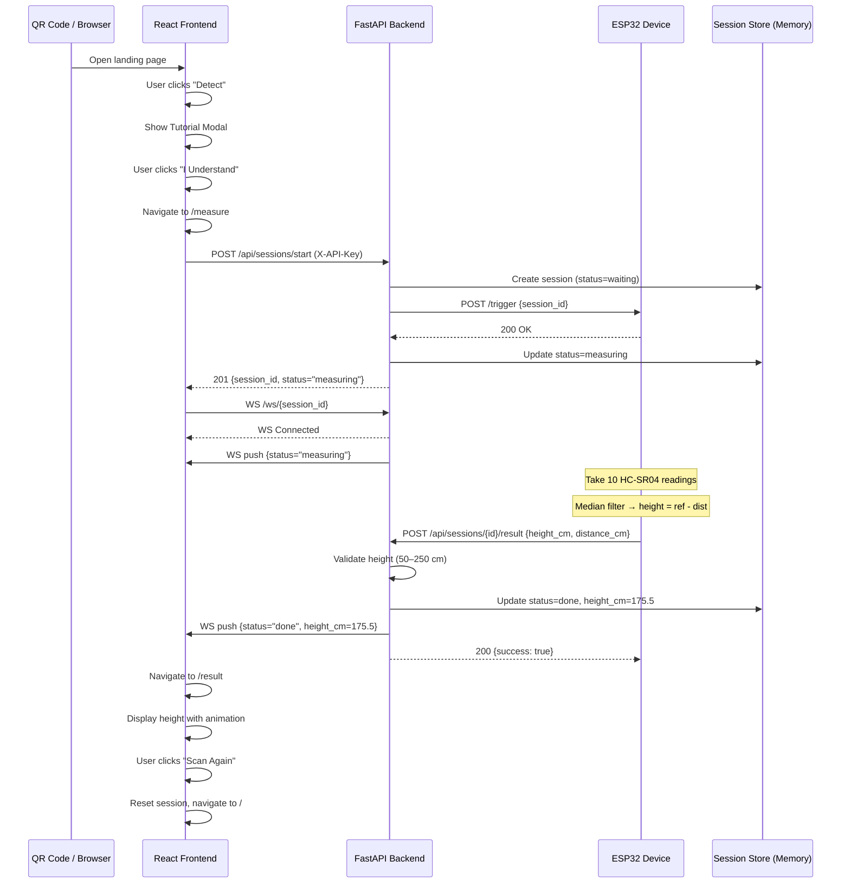
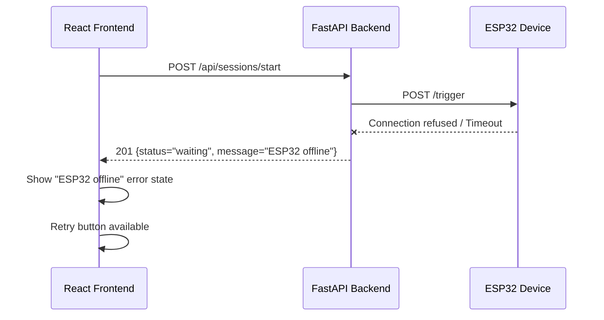
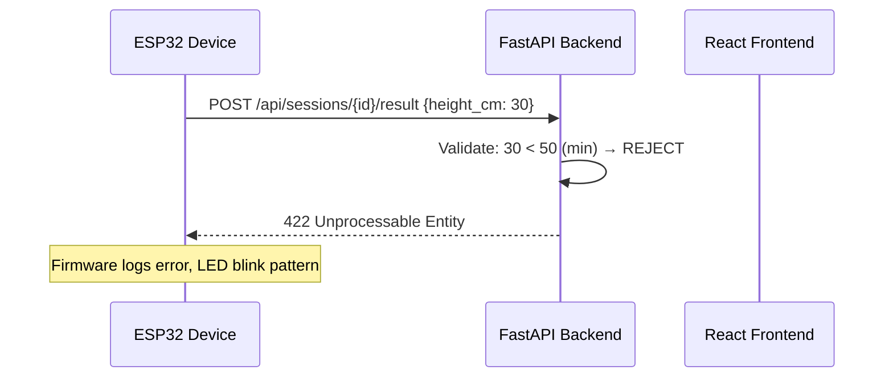
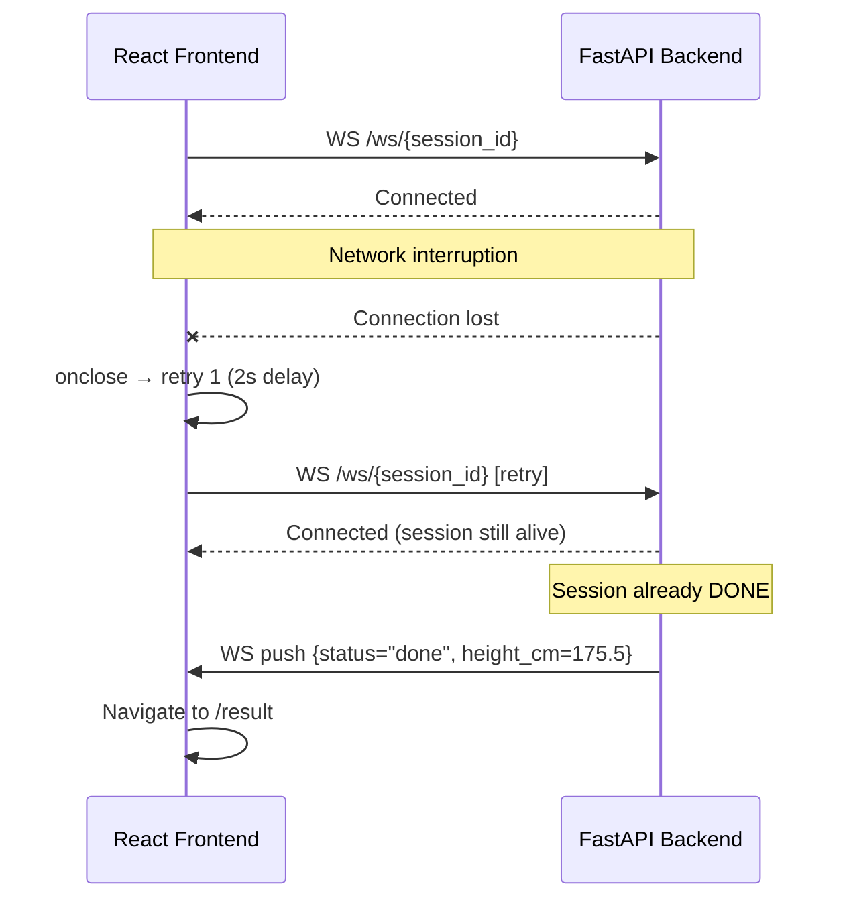

# Sequence Diagram

## Full Measurement Flow

```mermaid
sequenceDiagram
    participant QR   as QR Code / Browser
    participant FE   as React Frontend
    participant BE   as FastAPI Backend
    participant ESP  as ESP32 Device
    participant DB   as Session Store (Memory)

    QR->>FE: Open landing page
    FE->>FE: User clicks "Detect"
    FE->>FE: Show Tutorial Modal
    FE->>FE: User clicks "I Understand"
    FE->>FE: Navigate to /measure

    FE->>BE: POST /api/sessions/start (X-API-Key)
    BE->>DB: Create session (status=waiting)
    BE->>ESP: POST /trigger {session_id}
    ESP-->>BE: 200 OK
    BE->>DB: Update status=measuring
    BE-->>FE: 201 {session_id, status="measuring"}

    FE->>BE: WS /ws/{session_id}
    BE-->>FE: WS Connected
    BE->>FE: WS push {status="measuring"}

    Note over ESP: Take 10 HC-SR04 readings
    Note over ESP: Median filter → height = ref - dist

    ESP->>BE: POST /api/sessions/{id}/result {height_cm, distance_cm}
    BE->>BE: Validate height (50–250 cm)
    BE->>DB: Update status=done, height_cm=175.5
    BE->>FE: WS push {status="done", height_cm=175.5}
    BE-->>ESP: 200 {success: true}

    FE->>FE: Navigate to /result
    FE->>FE: Display height with animation
    FE->>FE: User clicks "Scan Again"
    FE->>FE: Reset session, navigate to /
```

## Error: ESP32 Offline

```mermaid
sequenceDiagram
    participant FE as React Frontend
    participant BE as FastAPI Backend
    participant ESP as ESP32 Device

    FE->>BE: POST /api/sessions/start
    BE->>ESP: POST /trigger
    ESP--xBE: Connection refused / Timeout
    BE-->>FE: 201 {status="waiting", message="ESP32 offline"}
    FE->>FE: Show "ESP32 offline" error state
    FE->>FE: Retry button available
```

## Error: Invalid Height

```mermaid
sequenceDiagram
    participant ESP as ESP32 Device
    participant BE  as FastAPI Backend
    participant FE  as React Frontend

    ESP->>BE: POST /api/sessions/{id}/result {height_cm: 30}
    BE->>BE: Validate: 30 < 50 (min) → REJECT
    BE-->>ESP: 422 Unprocessable Entity
    Note over ESP: Firmware logs error, LED blink pattern
```

## WebSocket Reconnection

```mermaid
sequenceDiagram
    participant FE as React Frontend
    participant BE as FastAPI Backend

    FE->>BE: WS /ws/{session_id}
    BE-->>FE: Connected
    Note over FE,BE: Network interruption
    BE--xFE: Connection lost
    FE->>FE: onclose → retry 1 (2s delay)
    FE->>BE: WS /ws/{session_id}  [retry]
    BE-->>FE: Connected (session still alive)
    Note over BE: Session already DONE
    BE->>FE: WS push {status="done", height_cm=175.5}
    FE->>FE: Navigate to /result
```
